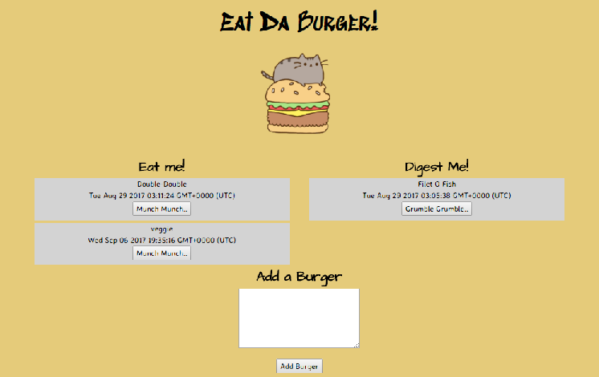

# Burger
Eat-Da-Burger!

### Overview
This assignments creates aburger logger with MySQL to query and route data, and Handlebars to generate the HTML.

### Instructions
1. This burger app that lets users input the names of burgers they'd like to eat.

2. Whenever a user submits a burger's name, your app will display the burger on the left side of the page -- waiting to be devoured.

3. Each burger in the waiting area also has a Munch Munch! button. When the user clicks it, the burger will move to the right side of the page.

4.  On the right side of the page, the burger also has a Grumble Grumble! button. When the user clicks it, the burger will be deleted from the page and the databaase.

### Technologies Used
- HTML
- CSS
- JavaScript
- Node.js
- MySQL
- JawsDB
- ORM
- Heroku

### Frameworks and Packages 
- Express.js
- jQuery
- Handlebars
- Body-Parser
- Method-override

### **[Demo](https://afternoon-eyrie-52134.herokuapp.com/)**
